<div align="center">



<h3>The open-source AI pentester that <em>proves</em> what it finds</h3>

<p><b>Autonomous agents that run your app in a sandbox, exploit it, and validate every finding with a reproduced proof-of-concept</b> — never a false positive from a static scanner.</p>

<p>
  
  
  
  
  
  
</p>

<p>
  <a href="#quick-start"><b>Quick start</b></a> &nbsp;·&nbsp;
  <a href="#features"><b>Features</b></a> &nbsp;·&nbsp;
  <a href="#trust--safety"><b>Trust &amp; safety</b></a> &nbsp;·&nbsp;
  <a href="#usage"><b>Usage</b></a> &nbsp;·&nbsp;
  <a href="#how-it-works"><b>How it works</b></a>
</p>

</div>

> **⚖️ Authorized use only.** Proofmark actively exploits the targets you point it
> at. Only run it against systems you own or have explicit, written permission to
> test. It refuses to start without an explicit `--authorized` assertion, records
> that assertion in every run, and refuses any request outside the scope you gave
> it — but the responsibility for having permission is yours.

---

<div align="center">

**Proof, not suspicion** &nbsp;•&nbsp; **Safe against production** &nbsp;•&nbsp; **Signed & replayable** &nbsp;•&nbsp; **Injection-resistant** &nbsp;•&nbsp; **Priced per run**

</div>

## Overview

Proofmark is an autonomous penetration-testing agent that acts like a real
attacker: it runs your code dynamically inside an isolated Docker sandbox, forms
a hypothesis, and **reproduces the exploit** before it reports anything. Every
finding carries the request it sent and the response that proves the impact. If
it can't prove it, it doesn't report it.

It is built for developers and security teams who want fast, accurate testing
without the overhead of a manual pentest or the noise of a static scanner — and
it is built to be **trustworthy enough to actually run**: enforced scope, and a
signed, replayable record of everything the agent did.

**Key capabilities**

- **Prove, don't guess** — findings are validated with a working proof-of-concept, not pattern-matched.
- **Full offensive toolkit** — recon, OSINT, an HTTP intercept proxy, a real browser, a code reader, a shell, and a verified auto-fixer.
- **Multi-agent** — a recon agent maps the target, then an exploit agent proves what it can, sharing a blackboard.
- **Any target** — a live URL, a local codebase, a git repo, an OpenAPI/Swagger spec, or a Postman collection.
- **Enforced authorization** — scope is checked in code, not asked of the model. Out-of-scope requests are refused before they leave the process.
- **Signed, replayable run records** — every run is tamper-evident and can be re-verified and replayed. With a public-key (ed25519) signature, *anyone* can verify a report is authentic without your secret. *This is the part a security team needs before it will let an agent exploit its systems — and no other tool in this space has it.*
- **Safe against production** — safe mode blocks destructive HTTP methods (PUT/PATCH/DELETE), so the agent proves impact with reads, never by altering data.
- **Prompt-injection resistant** — everything the target returns is fenced as untrusted data, so a hostile page can't hijack the agent with "ignore previous instructions."
- **Earned confidence** — a live finding is only rated *high* after the exploit reproduces a second time via replay. One response is a claim; two is proof.
- **Split-brain models** — run recon on a fast, cheap model and exploitation on a stronger one, cutting cost and time without losing reasoning where it matters.
- **Per-run cost accounting** — every run reports exact tokens and an estimated dollar cost, written into the signed record so what a run cost is attested alongside what it proved.
- **Provider-agnostic** — OpenAI, Anthropic, Azure and more, via LiteLLM.

## Why Proofmark is different

Most tools in this space race to be the most *capable* generalist. Proofmark is
built to be the most *trustworthy* one:

| | Typical AI pentester | Proofmark |
|---|---|---|
| Authorization | a warning in the docs | **enforced in code**, recorded per run |
| Out-of-scope requests | trusted to the model | **refused before they send** |
| Run record | logs, at best | **hash-chained, optionally signed, replayable** |
| "Does the exploit still work?" | re-run and hope | **`proofmark replay`** |

## Quick start

**Prerequisites:** Docker running, and an LLM API key from any supported provider.

```bash
# Install
pip install git+https://github.com/dugu0011/proofmark.git

# Check your environment
proofmark doctor

# Configure your provider (LiteLLM reads the key from the environment)
export ANTHROPIC_API_KEY="your-api-key"     # or OPENAI_API_KEY / AZURE_API_KEY

# Run your first assessment
proofmark scan -t https://staging.my-app.test --authorized --operator you@team.com
```

The first run pulls the sandbox image. Every run writes a tamper-evident record
to `proofmark_runs/<id>/`.

> **Testing a single-page app (React/Angular/Vue) or client-side bugs (XSS)?**
> Build the browser sandbox once — it adds a real headless Chromium:
> ```bash
> proofmark build-sandbox
> ```

## Every run is signed, verifiable, and replayable

This is Proofmark's core difference. Each scan writes a **tamper-evident record**
to disk: what was authorized, every step the agent took, every request it sent,
and every finding it proved — with the steps hash-chained, so any later edit is
provable.

```bash
proofmark verify proofmark_runs/20260101-120000    # is this record intact?
proofmark replay proofmark_runs/20260101-120000    # does the exploit still work?

export PROOFMARK_SIGNING_KEY="..."                 # HMAC-sign records — now attributable, not just unaltered
```

## Features

### Agentic toolkit

Proofmark's agents drive the same tools a professional tester would, each running
inside the sandbox:

- **Recon** — crawl same-host links, extract forms and their parameters, probe common paths (`.env`, `.git`, admin, api).
- **Subdomain OSINT** — passive discovery from Certificate Transparency logs. Never probes what it finds; marks what is in scope.
- **HTTP intercept proxy** — send, list, and **replay** requests with any field mutated. The capture-mutate-replay loop that confirms injection and authorization bugs.
- **Browser** — a real headless Chromium for client-side bugs (reflected/stored/DOM XSS, CSRF). A fired dialog is captured as proof injected script executed.
- **Code analysis** — list, read and search the source of a code target, confined to the source root.
- **Shell + Python** — run commands inside the sandbox for exploit development and validation.
- **Verified auto-fix** — the agent writes a patch; Proofmark applies it in memory and accepts it *only if it applies cleanly*. A broken fix never reaches the report.

### Vulnerability classes

Broken access control (IDOR, privilege escalation, auth bypass) · injection (SQL,
NoSQL, command, SSTI) · server-side (SSRF, XXE, deserialization, RCE) ·
client-side (XSS, CSRF, prototype pollution) · authentication & session · security
misconfiguration · exposed secrets · API security (mass assignment, broken authz).

### Graph of agents

`--strategy graph` runs a coordinated team instead of one generalist: a **recon
agent** maps the target and is told explicitly *not* to exploit — it records what
it finds — then an **exploit agent** starts from that map and proves what it can.
Findings from every phase aggregate, and the authorization gate and signed record
wrap the whole graph.

## Trust & safety

Proofmark is built to be pointed at real systems and believed:

- **Public-key signatures.** Generate a keypair with `proofmark keygen`, set `PROOFMARK_SIGNING_PRIVATE_KEY` to sign runs, and publish `PROOFMARK_SIGNING_PUBLIC_KEY`. Signed records embed the public key, so `proofmark verify <run>` confirms integrity with **no secret** — and pinning the public key also asserts *who* signed it.
- **Safe mode (default on).** Destructive methods are refused before they leave the process. Pass `--no-safe-mode` only when a state-changing test is genuinely required and authorized.
- **Untrusted-data fencing.** Target responses are wrapped in explicit markers and the agent is told they are data, never instructions — defusing prompt injection served by a hostile target.
- **Replay-gated confidence.** `high` confidence on a live target requires the exploit to reproduce on replay; otherwise it is recorded as `medium`.

```bash
proofmark keygen                                  # make a signing keypair
export PROOFMARK_SIGNING_PRIVATE_KEY=...           # sign every run
proofmark scan -t https://app.you.own --authorized --strategy graph \
  --recon-model openai/gpt-4o-mini --exploit-model anthropic/claude-opus-4-1
proofmark verify proofmark_runs/<run-id>           # anyone can verify, no secret
```

## Usage

```bash
# A live web application
proofmark scan -t https://your-app.test --authorized

# A local codebase — the agent reads AND runs it in the sandbox to prove bugs
proofmark scan -t ./my-service --authorized

# A git repository (shorthand or full URL)
proofmark scan -t owner/repo --authorized

# An OpenAPI / Swagger spec, tested against its server
proofmark scan -t ./openapi.yaml --base-url https://api.your-app.test --authorized

# A Postman collection
proofmark scan -t ./collection.json --base-url https://api.your-app.test --authorized

# A graph of agents: recon maps, exploit proves
proofmark scan -t https://your-app.test --authorized --strategy graph

# Write the report to a file (exits non-zero if anything is proven — good for CI)
proofmark scan -t https://your-app.test --authorized -o report.md
```

## CI/CD (GitHub Actions)

Proofmark ships a packaged action — gate pull requests with a few lines:

```yaml
name: proofmark

on:
  pull_request:

jobs:
  security-scan:
    runs-on: ubuntu-latest
    steps:
      - uses: actions/checkout@v4
      - uses: dugu0011/proofmark@v1
        with:
          target: ${{ vars.PREVIEW_URL }}   # a deployed preview you own
          authorized: "true"
          strategy: graph
        env:
          ANTHROPIC_API_KEY: ${{ secrets.ANTHROPIC_API_KEY }}
```

The job fails if a vulnerability is proven (configurable via `fail-on-findings`),
and the report is uploaded as an artifact.

## Use Proofmark from your coding agent

Proofmark is agent-ready. It ships a `SKILL.md` and an MCP server, so Claude Code,
Cursor, Codex or anything that speaks the Model Context Protocol can run a scan
and check a run record:

```bash
pip install "proofmark[mcp]"
proofmark mcp        # start the MCP server on stdio
```

## Configuration

Proofmark uses [LiteLLM](https://github.com/BerriAI/litellm), so any supported
provider works — set the model and the matching key:

```bash
export ANTHROPIC_API_KEY="..."     # for anthropic/... models (default)
export OPENAI_API_KEY="..."        # for openai/... models
export AZURE_API_KEY="..."         # for azure/... models

proofmark scan -t <target> --authorized --model openai/gpt-4o
```

Recommended models: `anthropic/claude-sonnet-4-6`, `openai/gpt-4o`.

## How it works

- `cli.py` — the command line
- `agent.py` — the plan→act→observe loop and its budgets
- `orchestrator.py` — the graph of agents, sharing a blackboard
- `tools/` — everything an agent can do; each declares a schema and runs in the sandbox
- `sandbox.py` — the Docker jail everything runs in (caps dropped, no host mounts)
- `authorization.py` — the scope gate, enforced in code
- `audit.py` — signed, hash-chained, replayable run records
- `llm.py` — one provider-agnostic call, via LiteLLM

Rename the whole product by editing the three names in `proofmark/__about__.py`.

## Contributing

Contributions of code, tools, and docs are welcome — open an issue or a pull
request. Run the test suite with `pytest` (Docker-backed tests skip
automatically when Docker is unavailable).

## Acknowledgements

Proofmark builds on the work of open-source projects including
[LiteLLM](https://github.com/BerriAI/litellm),
[Playwright](https://github.com/microsoft/playwright), and
[Docker](https://www.docker.com/). Thanks to their maintainers.

## License

MIT — see [LICENSE](LICENSE).

---

> **Warning — authorized use only.** Proofmark actively tests the targets you
> point it at. Only run it against systems you own or have explicit, written
> permission to test, and stay within the agreed scope. Unauthorized testing is
> illegal in most jurisdictions. You alone are responsible for obtaining
> authorization and complying with the law. Proofmark is provided "as is", with no
> warranty or liability for misuse.
